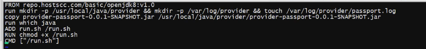
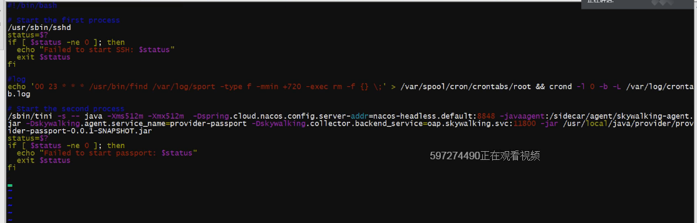

> Dockerfile

```dockerfile
FROM cdharbor.gome.inc/base/jre8:8u112 
run mkdir -p /usr/local/java/provider && mkdir -p /var/log/provider && touch /var/log/provider/passport.log
copy provider-passport-0.0.1-SNAPSHOT.jar /usr/local/java/provider/provider-passport-0.0.1-SNAPSHOT.jar
run which java
ADD run.sh /run.sh
RUN chmod +x /run.sh
CMD ["/run.sh"]
```

> run.sh



```sh
#!/bin/bash

# Start the first process
#/usr/sbin/sshd
status=$?
if [ $status -ne 0 ]; then
  echo "Failed to start SSH: $status"
  exit $status
fi

#log
#echo '00 23 * * * /usr/bin/find /var/log/sport -type f -mmin +720 -exec rm -f {} \;' > /var/spool/cron/crontabs/root && crond -l 0 -b -L /var/log/crontab.log

# Start the second process
exec java -Xms512m -Xmx512m  -Dspring.cloud.nacos.config.server-addr=nacos-headless.default:8848 -javaagent:/sidecar/agent/skywalking-agent.jar -Dskywalking.agent.service_name=provider-passport -Dskywalking.collector.backend_service=10.112.76.35:11800 -jar /usr/local/java/provider/provider-passport-0.0.1-SNAPSHOT.jar
status=$?
if [ $status -ne 0 ]; then
  echo "Failed to start passport: $status"
  exit $status
fi
```

> passport.yaml

```yaml
apiVersion: apps/v1
kind: Deployment
metadata:
  name: passport
spec:
  replicas: 1
  selector:
    matchLabels:
      app: passport
  minReadySeconds: 1
  strategy:
    type: RollingUpdate
    rollingUpdate:
      maxSurge: 1
      maxUnavailable: 1
  template:
    metadata:
      labels:
        app: passport
    spec:
      initContainers:
      - name: sidecar
        image: cdharbor.gome.inc/basic/skywalking-agent-sidecar:6.1.0
        command: ["cp", "-r", "/data/agent", "/sidecar"]
        volumeMounts:
        - name: sidecar
          mountPath: /sidecar
      containers:
      - name: passport
        image: cdharbor.gome.inc/springcloud/provider-passport:v1.0
        ports:
        - containerPort: 8086
          name: http
        #readinessProbe:
        #  tcpSocket:
        #    port: 8081
        #  initialDelaySeconds: 15
        #  periodSeconds: 10
        env:
        - name: aliyun_logs_passport-logs
          value: "stdout"
        volumeMounts:
        - name: sidecar
          mountPath: /sidecar
        resources:
          requests:
            memory: 512Mi
            cpu: 300m
          limits:
            memory: 768Mi
            cpu: 500m
      volumes:
      - name: sidecar
        emptyDir: {}
```

> svc.yaml

```yaml
[root@kvm-10-112-76-49 passport]# cat svc.yaml 
apiVersion: v1
kind: Service
metadata:
  name: passport-svc
  labels:
    app: passport-svc
spec:
  type: NodePort
  ports:
  - name: http
    port: 8086
    targetPort: 8086
    protocol: TCP
  selector:
    app: passport
```

> provider-passport-monitor.yaml

```yaml
kind: ServiceMonitor
apiVersion: monitoring.coreos.com/v1
metadata:
  name: passport-app
  labels:
    app: passport-app
spec:
  selector:
    matchLabels:
      app: passport-svc
  endpoints:
  - port: http
    interval: 1s
    path: /actuator/prometheus
```

