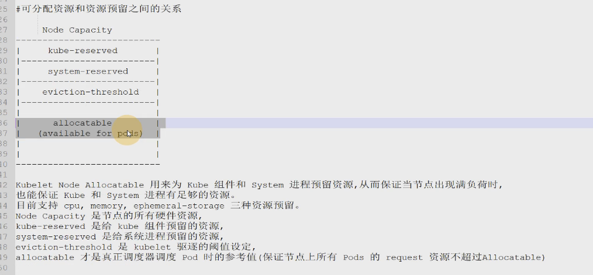
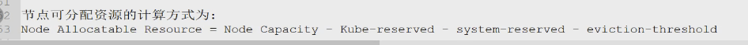
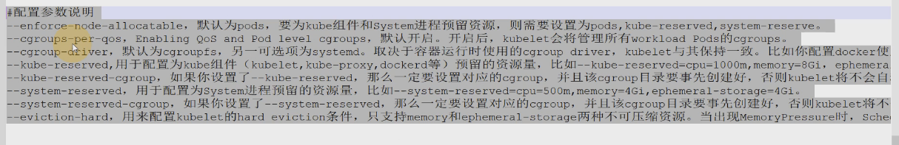
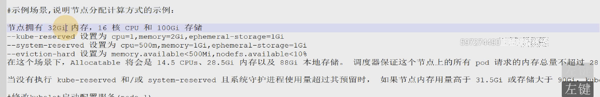

> kubelet.sh

```sh
mkdir -p /sys/fs/cgroup/hugetlb/system.slice/kubelet.service 
mkdir -p /sys/fs/cgroup/cpuset/system.slice/kubelet.service

--enforce-node-allocatable=pods,kube-reserved,system-reserved \
--kube-reserved-cgroup=/kubelet.service \
--system-reserved-cgroup=/system.slice \
--kube-reserved=cpu=1,memory=2Gi,ephemeral-storage=1Gi \
--system-reserved=cpu=500m,memory=1Gi,ephemeral-storage=1Gi \
--eviction-hard=memory.available<500Mi,nodefs.available<10%

完整如下：
#!/bin/bash

mkdir -p /sys/fs/cgroup/hugetlb/system.slice/kubelet.service
mkdir -p /sys/fs/cgroup/cpuset/system.slice/kubelet.service

/usr/local/bin/kubelet \
--logtostderr=true \
--v=4 \
--hostname-override=10.122.249.163 \
--kubeconfig=/etc/kubernetes/cfg/kubelet.kubeconfig \
--bootstrap-kubeconfig=/etc/kubernetes/cfg/bootstrap.kubeconfig \
--config=/etc/kubernetes/cfg/kubelet.config \
--cert-dir=/etc/kubernetes/ssl \
--pod-infra-container-image=docker.io/kubernetes/pause:latest \
--enforce-node-allocatable=pods,kube-reserved,system-reserved \
--kube-reserved-cgroup=/kubelet.service \
--system-reserved-cgroup=/system.slice \
--kube-reserved=cpu=1,memory=2Gi,ephemeral-storage=1Gi \
--system-reserved=cpu=500m,memory=1Gi,ephemeral-storage=1Gi \
--eviction-hard=memory.available<500Mi,nodefs.available<10%
```

