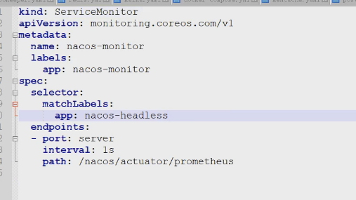

###下载docker版的nacos

```
git clone https://github.com/nacos-group/nacos-docker.git

#进入原码
cd /root/nacos-docker/build/init.d
cat custom.properties 
发现prometheus是注释掉的

如下：
# metrics for prometheus
#management.endpoints.web.exposure.include=*

关掉注释, 然后进行重新编译Dockerfile

#然后查看是否有metrics
http://nacos.gome.inc/nacos/actuator/prometheus
```

#创建服务发现



```yaml
[root@master-249-160 nacos]# cat nacos-servermonitor.yaml 
kind: ServiceMonitor
apiVersion: monitoring.coreos.com/v1
metadata:
  name: nacos-monitor
  labels:
    app: nacos-monitor
spec:
  selector:
    matchLabels:
      app: nacos-headless
  endpoints:
  - port: server
    interval: 1s
    path: /nacos/actuator/prometheus
```

#查看监控

