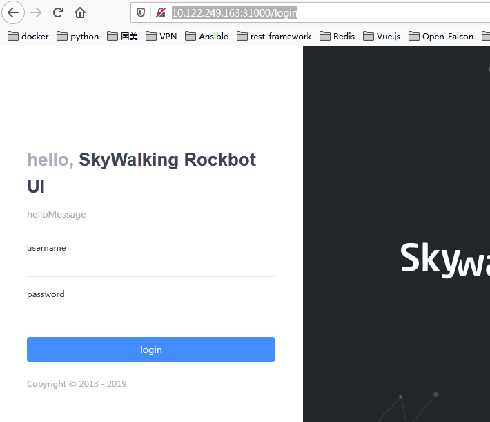
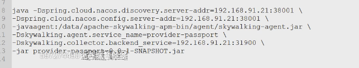

> 01-service.yml

```sh
apiVersion: v1
kind: Service
metadata:
  name: ui
  namespace: skywalking
  labels:
    service: ui
spec:
  ports:
  - port: 8080
    name: page
    nodePort: 31000
  type: NodePort
  selector:
    app: ui
```

> 02-deployment.yml

```yaml
apiVersion: apps/v1
kind: Deployment
metadata:
  name: ui-deployment
  namespace: skywalking
  labels:
    app: ui
spec:
  replicas: 1
  selector:
    matchLabels:
      app: ui
  template:
    metadata:
      labels:
        app: ui
    spec:
      containers:
      - name: ui
        image: apache/skywalking-ui:6.1.0
        ports:
        - containerPort: 8080
          name: page
        resources:
          requests:
            memory: 1Gi
          limits:
            memory: 2Gi
        env:
        - name: SW_OAP_ADDRESS
          value: oap:12800
```

> 打开web界面

```
http://10.122.249.163:31000/login
```



用户名：admin/admin


#测试



> 备注：31900是oap数据接收服务